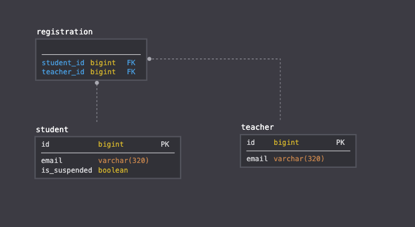
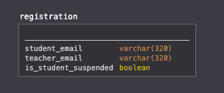
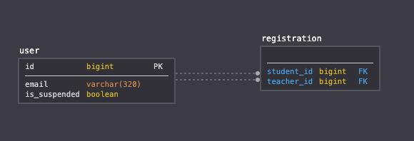

# Design Choices
## Database Schema
### V1

**Advantages:**
- **Intuitive Design** - Out of the many possible schema choices, this design is intuitive and easy to understand as it reflects how an equivalent physical record would document the information. Class structure is clearly maintained and is the sole principle behind this design and will be a valuable one to abide by in projects that will be maintained by many developers.

- **Easily Extendable** - As the student and teacher information are abstracted into their own tables, adding any additional attributes to the student or teacher class will not require the modification of an unrelated table. For example, if we need to specify the validity of the registration, we can easily and intuitively add an attribute the registration table to indicate that. The back-end logic will then only need to account for the inclusion of the new information. In a system that is undergoing a lot of changes in an iterative development cycle, this is worth considering.

**Disadvantages:**
- **Reads may take longer times** - This is a trivial point as modern machines are well equipped with enough RAM to store multiple large tables in memory (even more so with the fact that our tables contain little information and that we only have three tables). However, with a sizeable dataset in a machine that doesn't have enough memory to store all three tables, joins may take significantly longer and correspondingly affect read times.

> **Note:** I don't use MySQL enough to understand its internal implementation. Notably, B-Trees are used quite commonly amongst relational databases for efficient retrieval of data. The above point is made with the assumption that there are no specific optimisations for this case (which may not be so). However, this is worth noting as disk reads accounts for a significant portion of time in queries.

### V2

**Advantages:**
- **Simple Design** - Given our current requirements, this is the most simple design that works well. There is only one additional field `is_suspended` for the student class - which permits amassing of all the information into a table `registration`, which essentially describes the relationship we are looking to store. In a waterfall development cycle where we are sure that this is the final requirement, this is acceptable and perhaps recommended to avoid unnecessary over-engineering.

**Disadvantages:**
- **Consumes More Space** - Given the same information, this design will take more space as compared to V1 because of the repetition of information stored across entries (e.g. `is_suspended`, `teacher_email` and `student_email`). Irregardless of dataset size, the repetition of variable strings will quickly exceed the space used as compared to an `id` representation of the registration parties (student/teacher).

- **Updates take longer times** - Similar to the above point, one of our endpoints require setting the `is_suspended` status of a student. In this design, the operation of writing the `is_suspended` attribute across multiple registrations will take a longer time. Thus, if we model the users of the system as a graph, a densely connected network of users may not be very suitable for this schema.

- **Extensions May Not Be Intuitive** - Unlike V1, the addition of more complex features in future may prove to be difficult as all information is encapsulated into a single table. More descriptive names may be required to distinguish fields between the student and teacher. For example, we know that `is_suspended` only applies to student for now, but if the teachers are also susceptible to being suspended in future, then `is_student_suspended` and `is_teacher_suspended` may be most straightforward way to accomodate such a change. In all likelihood, most extensions of this schema design are not recommended. 

### V3

**Advantages:**
- **Optimised Results** - V3 serves as the middle ground between V1 and V2. We compromise between simplicity (measured by the number of tables) and intuitiveness (measured by maintaining of distinct class structure) to achieve an in-between solution. This is most optimal if the newer features to be added do not demand a clear distinction between the student and teacher classes, as it treats the two classes as a single one for some simplicity. In return, we save some memory usage on during database table reads (especially for )

- **Still open to modification** - Unlike V2, V3 is very much open to modification with the exception that there is a good reason to group the teachers and students together as users. For example, if it is very likely that they should be seen as users (i.e. any student can become a teacher and any teacher can become a student like in an MOOC platform), then there is good justification to keep this design and extend upon. 

**Disadvantages:**
- **Unique Case Use** - Despite being a lean design, it hinges upon a lot of assumptions that should be clarified before use. It's openness to modification further depends on those assumptions which makes this design usable only in specific use cases. 

### Verdict
Given the following assumptions:
- As stated in the task description, we may require to extend the APIs and design in future. Having a more flexible design is necessary to accomodate this.
- I assume that teachers are strictly teachers and students are strictly students like in a school setting (i.e. there is no student that is a teacher). 
- I assume we are using machines that are relevant in this day and age, and we are able to make the tradeoff of space for a comfortable and intuitive schema design.

I choose **V1** as the schema.

## Miscellaneous Choices
- **VARCHAR(320) for email attribute** - The standard dictates the following limitations: 64 characters for the "local part" (username), 1 character for the @ symbol, 255 characters for the domain name.[1](https://dba.stackexchange.com/questions/37014/in-what-data-type-should-i-store-an-email-address-in-database#:~:text=VARCHAR%20is%20the%20best%20data,space%20as%20compared%20to%20VARCHAR.)
